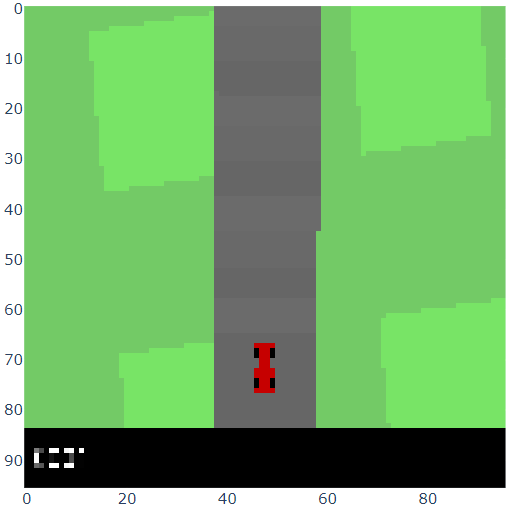

# Inspirit-AI-Deep-Dive-Designing-DL-Systems-FinalProject-RL-for-Autonomous-Vehicles

  

 

Acknowledgements: Since this was a group project that didn't involve pushing changes to a central repository, but rather working in our individual Jupyter Notebooks, I would like to acknowledge other group members who worked with me on this - Sainik Ghosh, Rohan Abraham, Athulya Saravanakumar, Marc Donghun Yoo, and Valerie Eng. I would also like to acknowledge Dr. Kuan Chuen Wu, Lead Data Scientist at CatapultX, for guiding me and our group in completing in project. Last, but not the least, I would like to thank Inspirit AI for helping with the starter code on most of these notebooks, especially with pre-defined functions for loading in and pre-processing datasets, library import statements, and starter code for various algorithm implementations throughout each of the notebooks.

The overall aim of this project was to teach a reinforcement learning agent to drive by itself by learning from its surroundings, and using that information to make a decision that will lead to the best reward. Some considerations going into this project were how automation can help ensure personal/environmental safety, prevent motor vehicle accidents, devastation of impaired driving, drugged driving, and unbelted vehicle occupants.

There are essentially 4 parts to accomplish this:
  1. We will initially explore how to implement a reinforcement learning loop and how we can enable the agent to distinguish among various objects in its surroundings
  2. Then, we will train a neural network to get predictions for every possible action, and implement a q-policy on the newly trained model
  3. Then, we will look at exploration vs exploitation in terms of q-learning, implement the Epsilon Greedy Policy, and train a DQL model that utilizes this algorithm and outputs a q-value for each of our actions. 
  4. To wrap it up, we will tweak the environment to penalize the agent, visualize loss graphs to estimate the extent to which the agent is able to safely navigate the environment, and finally run our model on a couple of simulations and see how well it performs.

The environment in which we will be training our agent has certain components and they are:
  1. States/observation - The current position of the agent or what the agent sees when it's in the environment
  2. Actions - The possible actions the agent can take in a a given state(traffic light)
  3. Rewards - A measure of how good taking a certain action in a state is
  
  
